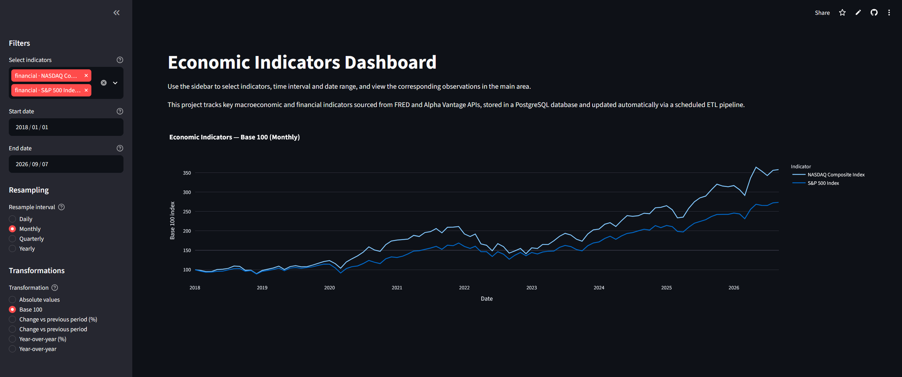
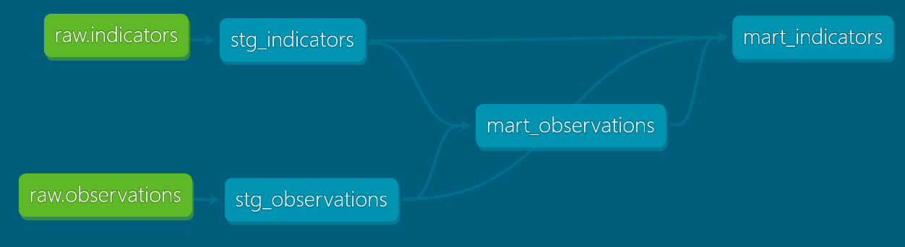

<div align="center">

# Economic Indicators Dashboard

**An automated ELT pipeline for macroeconomic and financial indicators.**

Portfolio project that pulls 13 indicators from the FRED and Alpha Vantage APIs, loads them raw into a
**Supabase** PostgreSQL database, models them with **dbt** into query-ready marts, and
serves them through a **Streamlit** dashboard. **GitHub Actions** refreshes the whole
chain every morning, and the same code runs unchanged against a local Docker container.

[](https://economicpipeline-eorellana.streamlit.app/)

[](https://www.python.org/)
[](https://www.postgresql.org/)
[](https://www.getdbt.com/)
[](https://supabase.com/)
[](https://www.docker.com/)
[](https://github.com/features/actions)
[](https://streamlit.io/)



</div>

---

## Why

Macroeconomic and financial indicators live scattered across public APIs, each with its
own format, frequency and rate limits. Collecting and cleaning them by hand means
repeating the same work every time, and the data goes stale the moment you stop.

This is a portfolio project, written to practise the full shape of a data platform:
extractors per source with local caching, idempotent loads, a modelling layer that makes
the series comparable, tests that assert what the schema cannot, and a dashboard that
filters precomputed data instead of recomputing it on every click.

The indicators publish at four different frequencies and in seven different units. Most
of the engineering here exists to make that difference explicit, and most of the design
decisions below follow from it.

### How it runs

```
 FRED API ─────────┐    ┌──────────────────┐   ┌─────────────┐   ┌────────────┐
                   ├───►│  Python          │──►│  Supabase   │──►│  Streamlit │
                   │    │  extract + load  │   │             │   │    Cloud   │
 Alpha Vantage ────┘    │  GitHub Actions  │   │  public ──► │   │  dashboard │
                        │  daily 09:00 UTC │   │  analytics  │   │            │
                        └──────────────────┘   └─────────────┘   └────────────┘
                                                      ▲
                                                     dbt
```

A scheduled GitHub Actions workflow runs every morning. Python pulls each series from
FRED or Alpha Vantage and upserts it, untouched, into the `public` schema of a **Supabase**
database — managed PostgreSQL, so the same driver and the same SQL serve it and the local
container alike.

**dbt** then runs against that database and builds the `analytics` schema: staging views
that type and rename, and marts that stack every series at four grains with their change
metrics already computed. Transformation happens inside the warehouse, not on the way in.

**Streamlit Community Cloud** serves the dashboard and reads only the marts, so a click
is a `WHERE` clause rather than a recalculation.

<div align="center">

</div>

## Indicators

| Symbol | Name | Category | Frequency | Unit | History from |
|---|---|---|---|---|---|
| CPIAUCSL | Consumer Price Index (All Urban Consumers) | macro | monthly | Index | 1947 |
| GDPC1 | Real Gross Domestic Product | macro | quarterly | Billions of Chained 2017 Dollars | 1947 |
| UNRATE | Unemployment Rate | macro | monthly | Percent | 1948 |
| FEDFUNDS | Federal Funds Rate | macro | monthly | Percent | 1954 |
| NASDAQCOM | NASDAQ Composite Index | financial | business daily | Index | 1971 |
| WTI | West Texas Intermediate Crude Oil | commodity | business daily | USD per Barrel | 1986 |
| BRENT | Brent Crude Oil | commodity | business daily | USD per Barrel | 1987 |
| WHEAT | Wheat (global price) | commodity | monthly | USD per Metric Ton | 1992 |
| CORN | Corn (global price) | commodity | monthly | USD per Metric Ton | 1992 |
| NATURAL_GAS | Natural Gas (Henry Hub) | commodity | business daily | USD per MMBtu | 1997 |
| GOLD | Gold | commodity | daily | USD per Ounce | 2011 |
| SILVER | Silver | commodity | daily | USD per Ounce | 2011 |
| SP500 | S&P 500 Index | financial | business daily | Index | rolling 10 years |

A full load is about 59,000 raw observations, which the marts expand to roughly 64,000
rows across four grains.

`SP500` is the odd one: FRED serves it as a rolling ten-year window, so its start date
moves forward every day. That single fact drove two of the decisions below.

## Design decisions

### ELT, not ETL, and what moving the fill revealed

The pipeline used to clean data before persisting it. Two of those cleaning steps were
forward-filling gaps and resampling, and both were wrong in the ingestion layer: they
wrote values the source never published.

The forward fill turned out to be worse than a rounding issue. Alpha Vantage returns
observations newest-first, and a forward fill propagates in row order, so it was filling
**backwards in time**. Corn has no data between 1980 and 1991; those 144 months were
being stored with the price from January 1992. The database held twelve years of 1980s
corn prices that were, literally, a future value.

Removing it also stopped inventing roughly 1,500 market-holiday observations across the
daily series. The gaps are now absent from the table: on a day the market was closed,
there is no observation.

### The category is a column, not a table

Splitting macro and financial indicators into separate fact tables would encode a
distinction that is semantic rather than structural: the S&P 500 and the NASDAQ come from
FRED, exactly like the unemployment rate. Same source, same shape, same ingestion path.

`category` lives in the dimension. It groups the dashboard selector and nothing else,
which is what it actually is: navigation, not architecture.

### Year-over-year depends on the grain, not on the series

A percentage change is meaningless without knowing what one row represents. The original
dashboard called `pct_change()` on whatever it had, so the same button meant "since
yesterday" for the NASDAQ and "since last quarter" for GDP, drawn on one axis.

The marts stack every series at four grains — day, month, quarter, year — in a `grain`
column, and the lag follows the grain: 12 rows back for monthly, 4 for quarterly, 1 for
yearly. The dashboard filters `WHERE grain = ...` instead of resampling. The parameter
became data.

Year-over-year is deliberately **null at day grain**. A calendar year is not a fixed
number of trading days, and the count shifts with every holiday, so any row offset would
be an approximation presented as exact.

The mart also carries the change against the *previous* period, which is a different
measure and not a substitute. In mid-2022, US year-over-year inflation still read 8.5%
while month-over-month had already fallen to zero: the annual figure was being dragged by
the preceding eleven months. Statistical agencies publish both for that reason.

### Percentage points versus percentage change

Every change metric comes in two flavours. Unemployment going from 5% to 10% rose 100% in
relative terms and 5 percentage points in absolute terms. The second is what economists
quote, because a percentage of a percentage misleads.

The rule follows the unit: series measured in `Percent` are read as percentage points,
levels and prices as percentage change. The dashboard labels the axis accordingly.

### One base date for the whole chart

Rebasing to 100 at the start of the visible window is standard practice. Rebasing each
series to *its own* first observation is not, and that is what the dashboard did: with
NASDAQ history from 1971 and S&P 500 history from 2016, both lines started at 100 and the
eye read them as starting together.

The base is now a single date shared by every series on the chart, clamped to the latest
start date among them, with the chart trimmed to that window and a caption explaining the
move. This is why `mart_indicators` derives `start_date` from the data instead of
declaring it: with `SP500` on a rolling window, a hand-written date would go stale on its
own.

### Full reloads are deliberate

Every run refetches each series' complete history. That looks wasteful and is not:
**FRED revises published figures backwards.** GDP is restated quarters later, and CPI is
revised with the annual seasonal-adjustment update, which touches years of history. An
incremental load that only asked for new observations would silently never see any of it.

It also costs nothing extra. FRED returns the whole series in one request regardless, and
the Alpha Vantage commodity endpoints accept no date filter at all. The only real cost is
write volume, and the upsert avoids it: `WHERE observations.value IS DISTINCT FROM
EXCLUDED.value` means unchanged rows are never touched, so the load timestamp marks
revisions rather than pipeline runs.

### Tests that assert what the schema cannot

The database already enforces primary keys, foreign keys and not-null constraints, so
tests restating them cannot fail. They are still there, because dbt runs against
warehouses that do not enforce keys, and because `CREATE TABLE AS` drops every constraint:
on the marts those same tests are the only guarantee left.

The tests that carry real weight are the ones no schema can express:

| Test | What it catches |
|---|---|
| `accepted_values` on category and frequency | a typo in the indicator catalog, which is plain text in the database |
| No future dates | a source publishing forward-dated rows |
| Series not stale | a feed that stopped, with thresholds per frequency |
| No scale jumps | a unit or scale change at the source |
| Non-negative values | a sign error, on the series where a negative is impossible |

Two of those needed calibrating against reality rather than intuition.

**Staleness thresholds are set by publication lag, not by frequency.** A quarterly series
dated at the start of its period can be seven months "behind" and be perfectly healthy:
Q2 is stamped April 1st and Q3 is not published until late October. A naive 90-day rule
would flag GDP permanently.

**The non-negative test excludes oil.** WTI settled at −36.98 on 2020-04-20, and that
value is correct: storage cost more than the barrel was worth. A blanket positivity check
would paint one of the most famous days in oil markets red, forever.

That difference drives the severity rule: **warn when a finding could be a real event,
error when it cannot.** A gap can be a holiday and a spike can be a winter storm, but a
negative unemployment rate cannot exist.

### Two environments, one codebase

| | Development | Production |
|---|---|---|
| Database | PostgreSQL in Docker Compose | Supabase |
| Scheduling | manual | GitHub Actions, daily |
| Dashboard | localhost:8501 | Streamlit Community Cloud |
| dbt target | `dev` | `prod` |

The same code runs in both. Credentials resolve from environment variables, from a `.env`
file, or from `st.secrets`, in that order, so the pipeline, the workflow and the hosted
app share one configuration path with no branching on where they run.

The two dbt targets differ in exactly one line: `sslmode`. Supabase refuses unencrypted
connections and the local container has no TLS configured, so `dev` cannot reach
production and `prod` cannot reach the local database. Crossing environments by accident
fails immediately instead of writing to the wrong place.

Development happens against the local container on purpose: it costs no API quota, leaves
the deployed data untouched, and works offline.

### Metadata joins after the sort, not before

Production runs on Supabase's free tier: a shared instance with 2 MB of `work_mem` and a
two-minute `statement_timeout`. A scheduled build hit that ceiling and was cancelled
mid-model.

The query was not the problem: measured on the same instance while idle, it completes in
about a second. It was carrying four text columns through the sort that collapses 231,000
expanded rows, columns nothing reads until the final `SELECT`. Joining the indicator
metadata *after* the window functions cut the sorted row from 100 bytes to 51, the
temporary spill from 20.6 MB to 8.4 MB, and the query from 2.5s to 1.1s.

A `pre_hook` raises `statement_timeout` to five minutes for that model. It makes nothing
faster: it means an instance that is throttled at that moment produces a slow build
instead of a failed one.

## Architecture

```
economic_pipeline/
├── .github/workflows/      # Daily pipeline + dbt build
├── sql/schema.sql          # Raw tables and constraints
├── setup_db.py             # Applies the schema
├── docker-compose.yml      # Local stack: PostgreSQL + app
├── requirements.txt        # What Streamlit Cloud installs
├── src/
│   ├── run_pipeline.py     # Entry point: extract, parse, load
│   ├── config.py           # Indicator catalog, credential resolution
│   ├── extract/            # FRED and Alpha Vantage clients, with cache
│   ├── parse/              # JSON to DataFrame, no business logic
│   ├── load/               # Batched upserts
│   ├── db/connection.py    # psycopg2 connection
│   └── app/                # Streamlit dashboard
└── dbt/
    ├── models/staging/     # Typed and renamed, one model per source
    ├── models/marts/       # Grain stacking, change metrics, dimension
    ├── tests/              # Singular tests
    └── profiles.yml        # dev and prod targets
```

`src/parse/` is named for what it does. Turning a JSON payload into rows is format
translation, not transformation, and dbt cannot do it: dbt only sees tables that are
already in the database.

### Layers

| Layer | Where | Contents |
|---|---|---|
| Bronze | `public` | `indicators`, `observations`, exactly as published |
| Silver | `analytics.stg_*` | typed and renamed, views over the sources |
| Gold | `analytics.mart_*` | four grains, change metrics, derived date ranges |

## Setup

### Prerequisites

- [Docker](https://www.docker.com/) and Docker Compose
- A free API key from [FRED](https://fred.stlouisfed.org/docs/api/api_key.html)
- A free API key from [Alpha Vantage](https://www.alphavantage.co/support/#api-key)

### 1. Clone and configure

```bash
git clone https://github.com/EmiOrellana/economic_pipeline.git
cd economic_pipeline
cp .env.example .env
```

Fill in the API keys and leave the database block pointing at the local container.

### 2. Start the stack

```bash
docker compose up --build
```

One command brings up PostgreSQL, applies the schema, runs a first full load, builds the
dbt models and their tests, and serves the dashboard.

### 3. Open the dashboard

[http://localhost:8501](http://localhost:8501)

### Working outside the container

To iterate on the models or the app without rebuilding the image, run the database alone
and everything else on the host:

```bash
docker compose up -d db
pip install -e ".[dbt]"
python setup_db.py
python src/run_pipeline.py
cd dbt && dbt deps && dbt build
streamlit run src/app/main.py
```

`dbt build` runs models and tests together, in dependency order.

## Usage

The sidebar controls the chart:

- **Indicators**, grouped by category
- **Date range**
- **Resample interval**, restricted to the grains every selected series actually has, so
  quarterly GDP never offers a daily view
- **Transformation**: absolute values, Base 100, change against the previous period, or
  year-over-year, each in percent or in the series' own unit

Year-over-year disappears from the options at daily grain, and mixing units in absolute
mode raises a warning: a policy rate and an equity index share no scale.

## Data updates

GitHub Actions runs the pipeline and `dbt build` daily at 09:00 UTC, and the workflow can
be triggered by hand from the Actions tab.

A run fails loudly. The pipeline records every indicator it could not load and exits
non-zero at the end, so a partial failure shows red instead of green. The series that did
load are still committed, since each indicator is its own transaction.

## Limitations

- **No snapshots yet.** Revisions are detectable through the load timestamp but not
  versioned, so the previous value of a restated figure is lost. dbt snapshots on `GDPC1`
  are the natural next step.
- **No Python tests.** Data quality is covered by 28 dbt tests; the parsing code, which
  handles three different JSON shapes, is not.
- **Alpha Vantage's free tier is a hard ceiling** at roughly 25 calls per day, which is
  what the local response cache exists to work around.
- **The dashboard is the endpoint of a pipeline, not an analysis tool.** The indicators
  were chosen to exercise two APIs with different shapes, not because they form a coherent
  analytical set. Making series plottable together is not the same as making them
  comparable, which is why the unit warnings exist.

## Notes

- Raw API responses are cached under `data/raw/` with a 24-hour TTL (gitignored). A
  response that fails validation is never written, so a rate-limit reply cannot poison the
  cache.
- Supabase is PostgreSQL, so the same adapter serves both environments. Connections go
  through the session pooler: the direct endpoint resolves over IPv6 only, which GitHub
  Actions runners cannot reach.
