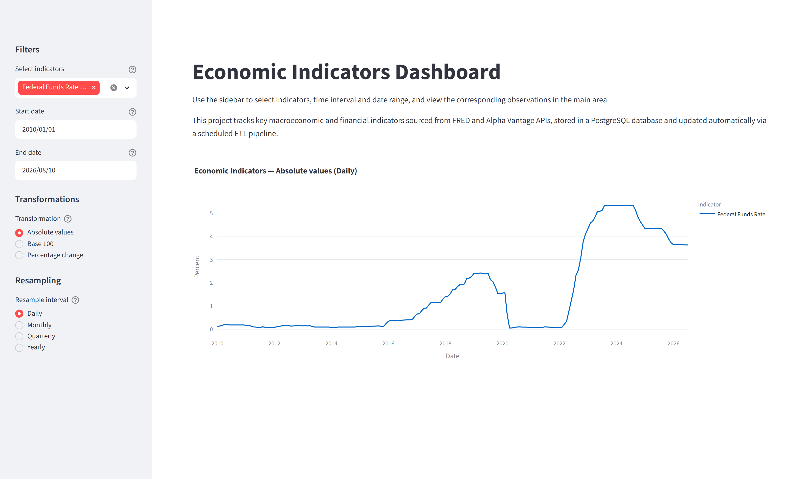

<div align="center">

# Economic Indicators Dashboard

**An automated ETL pipeline for macroeconomic and financial indicators.**

Pulls 13 indicators from two public APIs, normalizes them, loads them into PostgreSQL
and serves them through an interactive dashboard. The whole stack is reproducible with
one Docker Compose command and refreshes nightly without manual intervention.

[](https://www.python.org/)
[](https://www.postgresql.org/)
[](https://www.docker.com/)
[](https://pandas.pydata.org/)
[](https://streamlit.io/)
[](https://plotly.com/python/)



</div>

---

## Why

Macroeconomic and financial indicators live scattered across public APIs, each with its
own format, frequency and rate limits. Collecting and cleaning them by hand means
repeating the same work every time, and the data goes stale the moment you stop.

This project builds the full shape of a data pipeline rather than a script that downloads
a CSV: extractors per source with local caching, a normalization layer, idempotent loads
into PostgreSQL, and a dashboard that reads from the database instead of from the APIs.

**End-to-end flow:**

```
FRED API ──────────┐
                   ├──► ETL Pipeline (Python) ──► PostgreSQL ──► Streamlit Dashboard
Alpha Vantage API ─┘
```

## Indicators

| Symbol | Name | Source | Unit |
|---|---|---|---|
| FEDFUNDS | Federal Funds Rate | FRED | Percent |
| UNRATE | Unemployment Rate | FRED | Percent |
| CPIAUCSL | Consumer Price Index (All Urban Consumers) | FRED | Index |
| SP500 | S&P 500 Index | FRED | Index |
| GDPC1 | Real Gross Domestic Product | FRED | Billions of Chained 2017 Dollars |
| NASDAQCOM | NASDAQ Composite Index | FRED | Index |
| WTI | West Texas Intermediate Crude Oil | Alpha Vantage | USD per Barrel |
| BRENT | Brent Crude Oil | Alpha Vantage | USD per Barrel |
| NATURAL_GAS | Natural Gas | Alpha Vantage | USD per MMBtu |
| WHEAT | Wheat | Alpha Vantage | USD per Bushel |
| CORN | Corn | Alpha Vantage | USD per Bushel |
| GOLD | Gold | Alpha Vantage | USD per Ounce |
| SILVER | Silver | Alpha Vantage | USD per Ounce |

A full load reaches roughly 60,000 observations, with the oldest FRED series going back
to 1947.

## Architecture

```
economic_pipeline/
├── setup_db.py             # Database schema setup
├── start.sh                # Container startup sequence
├── Dockerfile              # App container definition
├── docker-compose.yml      # Multi-container orchestration
├── crontab                 # Nightly schedule
├── sql/schema.sql          # Tables and constraints
└── src/
    ├── run_pipeline.py     # Pipeline entry point
    ├── config.py           # API keys, DB config, indicator definitions
    ├── extract/            # FRED and Alpha Vantage extractors (with caching)
    ├── transform/          # Cleaning and normalization
    ├── load/               # Upsert logic
    ├── db/connection.py    # PostgreSQL connection handler
    └── app/                # Streamlit dashboard, queries and transformations
```

### Pipeline stages

| Stage | What happens |
|---|---|
| **Extract** | Extractors pull each indicator from FRED or Alpha Vantage, caching raw JSON with a 24-hour TTL and pausing between calls to respect rate limits. |
| **Transform** | Payloads from two sources that agree on almost nothing are cleaned into a common schema: consistent dates, units and symbols. |
| **Load** | Observations are upserted via `ON CONFLICT`, one atomic transaction per indicator. |
| **Bootstrap** | On startup the container waits for PostgreSQL, applies the schema and runs a first full load. |
| **Schedule** | Cron re-runs the pipeline nightly, reading credentials from an environment snapshot written at startup. |
| **Serve** | The dashboard queries the database with Base-100, percentage-change and resampling transformations. |

### Engineering decisions

| Decision | Rationale |
|---|---|
| **Idempotent loads** (`ON CONFLICT`) | Re-running never duplicates rows or corrupts the dataset. "Run it again" is always a valid answer to a failure. |
| **One transaction per indicator** | Each indicator is ingested atomically with isolated error handling, so a malformed payload from one source costs that source, not the whole run. |
| **24-hour response cache** | Respects Alpha Vantage's 25-calls/day free tier and makes development possible: without it, every re-run would burn the daily budget. |
| **Environment snapshot for cron** | Cron starts with a minimal environment and inherits neither the container's credentials nor its PATH, so `start.sh` writes what the job needs to `/app/cron.env` for it to source. |
| **Full containerization** | Database, ETL, scheduler and dashboard come up together and reproduce anywhere with one command. |

## Setup

### Prerequisites

- [Docker](https://www.docker.com/) and Docker Compose
- A free API key from [FRED](https://fred.stlouisfed.org/docs/api/api_key.html)
- A free API key from [Alpha Vantage](https://www.alphavantage.co/support/#api-key)

### 1. Clone

```bash
git clone https://github.com/EmiOrellana/economic_pipeline.git
cd economic_pipeline
```

### 2. Configure

```bash
cp .env.example .env
```

Fill in your credentials:

```env
FRED_API_KEY=your_fred_api_key
ALPHA_VANTAGE_API_KEY=your_alpha_vantage_api_key

DB_HOST=db
DB_PORT=5432
DB_NAME=economic_pipeline
DB_USER=postgres
DB_PASSWORD=your_password
```

`DB_HOST=db` is the correct value for Docker. Running locally without Docker, use `localhost`.

### 3. Start

```bash
docker compose up --build
```

This starts PostgreSQL, creates the schema, runs the initial load, starts the cron
scheduler and serves the dashboard.

### 4. Open

[http://localhost:8501](http://localhost:8501)

## Usage

The sidebar controls the chart:

- **Select indicators**: one or more series to display
- **Date range**: filter observations
- **Transformation**: absolute values, Base 100 index, or percentage change
- **Resample interval**: day, month, quarter or year

Mixing indicators with different units in absolute mode triggers a warning suggesting
Base 100 or percentage change, because a policy rate and an equity index share no scale.

## Data updates

The pipeline runs nightly at midnight (UTC) via cron. To trigger a manual update:

```bash
docker compose exec app python src/run_pipeline.py
```

Logs are written to `/var/log/pipeline.log` inside the container.

## Limitations

- The dashboard is the visual endpoint of the pipeline, not an analysis tool. The
  indicators were chosen to exercise two different APIs, not because they form a
  coherent analytical set. Base 100 makes them plottable together, which is not the
  same as comparable.
- No automated tests; correctness has been verified by inspecting loaded data.
- Cron inside the container is the right size here but it is not an orchestrator: no
  retries, no dependency graph, no visibility into a failed run beyond the log file.
- No selective backfill: the pipeline refetches an indicator's full history rather than
  reconciling a date range.
- Alpha Vantage's free tier is a hard ceiling at 25 calls per day.

## Notes

- FRED is effectively unlimited in practice; Alpha Vantage is not, which is what the
  local cache exists for.
- Raw API responses are cached under `data/raw/` (gitignored).
